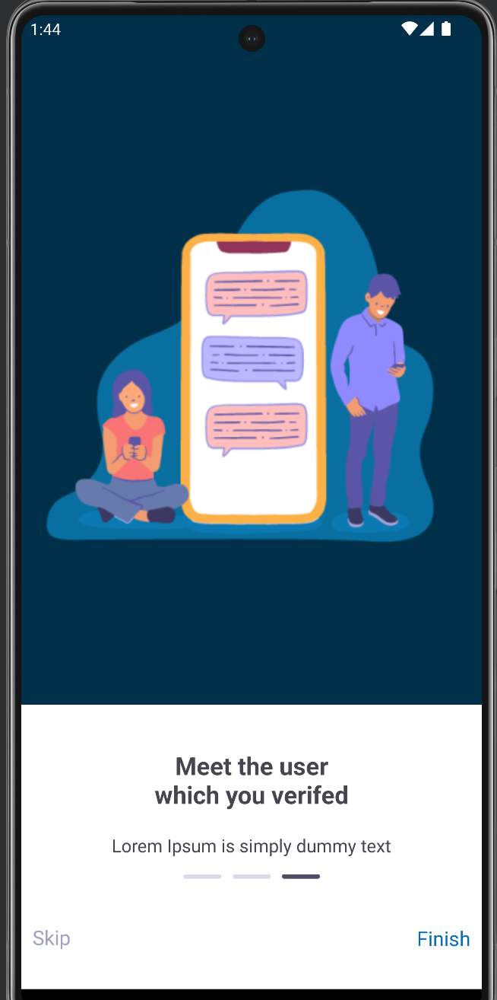
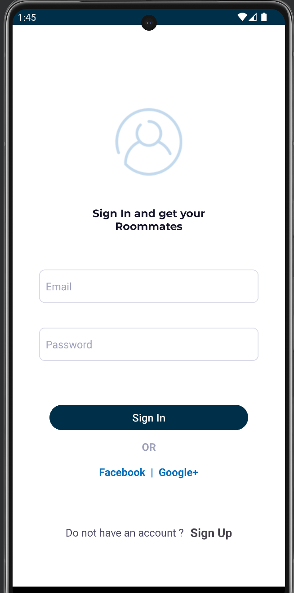
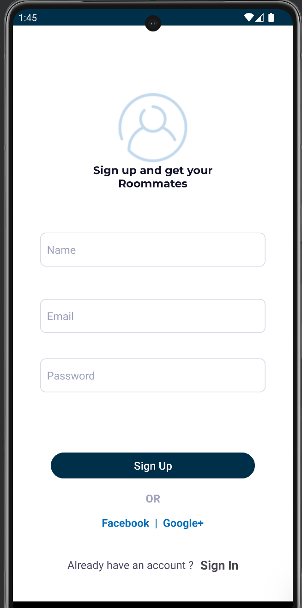
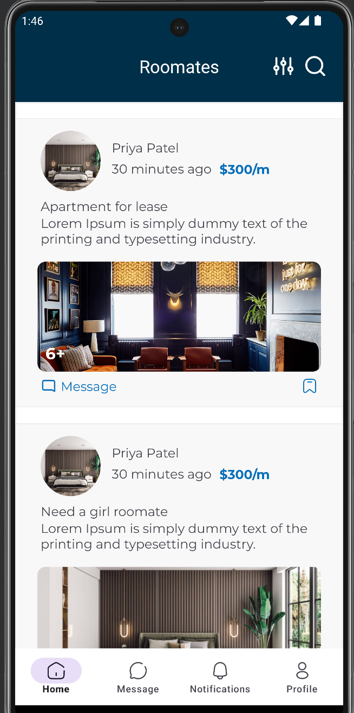
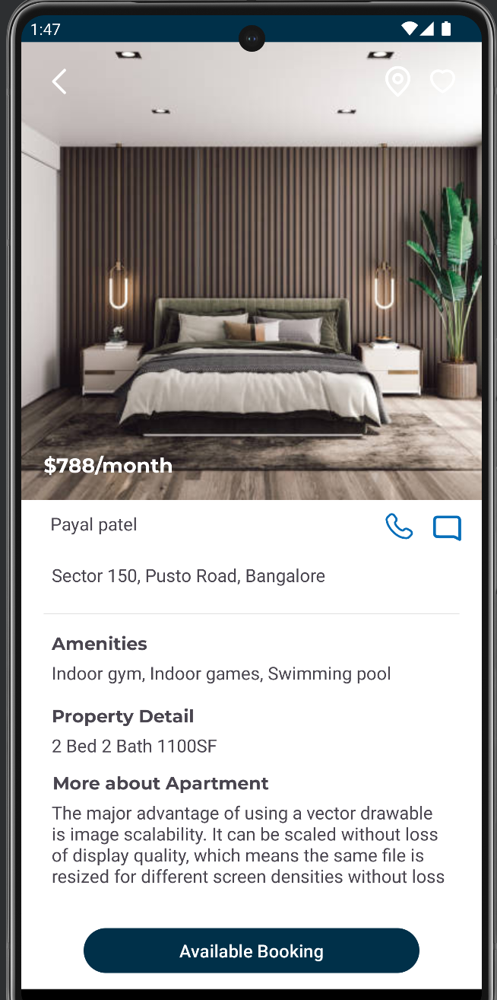

## FindRoomates

This is an app developed in Kotlin(Android). This app focuses on the problem people have finding a roomate and simplifies it using an application.

## Core concepts
- dependency injection
- mvvm architecture
- viewmodel
- retrofit
- firebase authentication and db
- coroutines
- sharedpreferences for persistence
- Viewpager
- Navigation Component
- data binging

# App's user interface

  

